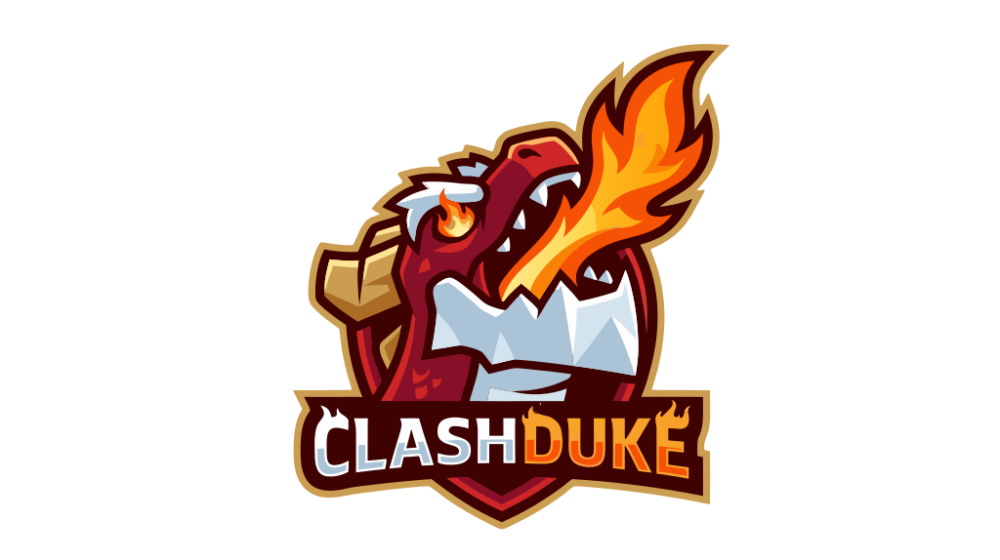

  

  

### Run your entire Clash of Clans community from one place.

Wars and CWL, Legend League tracking, rosters, reminders, moderation, autoroles,
log feeds — and a full web dashboard behind it.

 

---

## What it does

ClashDuke is a Discord bot and web dashboard for Clash of Clans clans and families.
It watches your clans continuously, posts what changed, and keeps the records the game
itself throws away.

<table>
<tr>
<td width="50%" valign="top">

<h3>&nbsp; War &amp; CWL</h3>
Live war state, attack-by-attack feeds, missed-attack reminders, and a full CWL round
tracker. War logs kept far past the ten wars the game keeps.

<h3>&nbsp; Legends &amp; Ranked</h3>
Per-day Legend League tracking — every attack and defence, trophies in and out,
streaks and ladder rank. Weekly ranked tournaments archived with the finishing
standing, which stops being fetchable one reset later.

<h3>&nbsp; Rosters &amp; Signups</h3>
Build rosters, take signups, check eligibility against town hall, heroes and
trophies, and export the result.

</td>
<td width="50%" valign="top">

<h3>&nbsp; Reminders</h3>
War attacks, clan games, capital raids, CWL rounds. Sent to the people who still owe
something, not to everyone.

<h3>&nbsp; Log feeds</h3>
Joins, leaves, donations, promotions, town hall upgrades, hero and equipment
progress, super troop boosts, war preference changes — each a separate feed you can
point at its own channel.

<h3>&nbsp; Roles &amp; Moderation</h3>
Automatic roles from clan membership, role, town hall and trophy band. Link
verification with the in-game API token, so a linked account is a proven one.

</td>
</tr>
</table>

<h3>&nbsp; Web dashboard</h3>

Everything the slash commands do, plus the views that do not fit in a Discord embed —
history, comparisons, and per-member breakdowns. At **[clashduke.com](https://clashduke.com)**.

---

## Getting started

<table>
<tr><td width="60"><b>1</b></td><td>

**[Add ClashDuke to your server →](https://clashduke.com/invite)**

</td></tr>
<tr><td><b>2</b></td><td>

`/link-clan` — link your clan to the server.

</td></tr>
<tr><td><b>3</b></td><td>

`/setup` — countdowns, events, link parsing and preferences. `/setup list` shows what
is linked and which feeds are running.

</td></tr>
<tr><td><b>4</b></td><td>

`/reminders` — war, capital, clan games, legend, roster and inactivity reminders.

</td></tr>
<tr><td><b>5</b></td><td>

`/ask` — ask anything in plain English. It answers from the documentation.

</td></tr>
</table>

There are **76 commands**. `/help` lists them all, and every one is documented.

Full walkthroughs, every command and every option: **[docs.clashduke.com](https://docs.clashduke.com)**

---

## Links

| | |
| --- | --- |
|  **Website** | [clashduke.com](https://clashduke.com) |
|  **Documentation** | [docs.clashduke.com](https://docs.clashduke.com) |
|  **Add to your server** | [clashduke.com/invite](https://clashduke.com/invite) |
|  **Support server** | [discord.gg/8997YX5gpA](https://discord.gg/8997YX5gpA) |

---

## Support

Something broken, or a feature you want? The **[support server](https://discord.gg/8997YX5gpA)**
is the fastest way to reach us — bug reports, questions, and feature requests all
welcome there. `/discord` from inside any server gets you the invite too.

If you are reporting a problem, the two things that make it quick to fix are the
**command you ran** and the **clan or player tag** involved.

---

  

**ClashDuke** is not affiliated with, endorsed by, or sponsored by Supercell. 
Clash of Clans and all related assets are trademarks of Supercell. 
Built under Supercell's [Fan Content Policy](https://supercell.com/en/fan-content-policy/).

